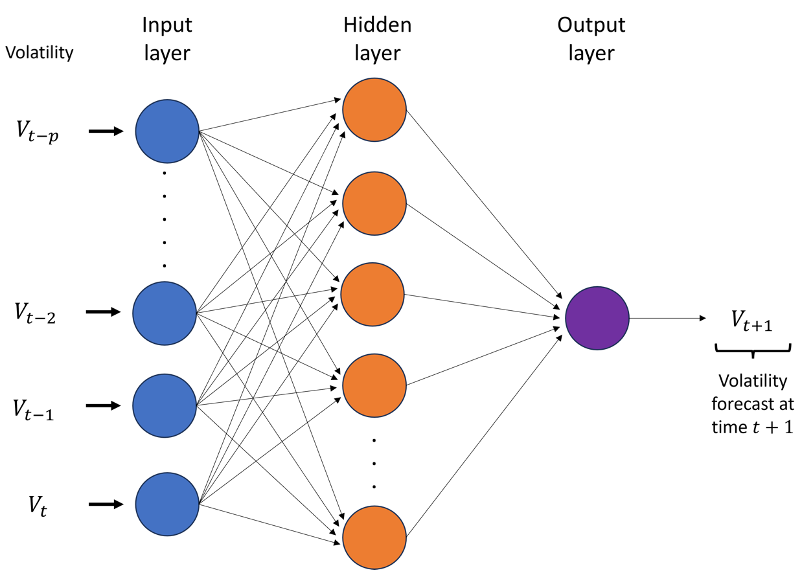

# The Superiority of Direct Neuro Volatility Forecasts Over GARCH and Machine Learning Forecasts for Financial Assets

Incorporating robust risk measures in investment decisions ensures optimal capital allocation and mitigates financial losses. Key measures include volatility, value-at-risk (VaR), and expected shortfall (ES), where volatility represents the standard deviation of log returns. VaR and ES can be derived using volatility forecasts when the return distribution is known. Following the 2008 financial crisis, there has been a shift toward more complex risk measures, with the Basel III Committee recommending sophisticated models for risk estimation to prevent financial losses.

Traditional GARCH models estimate volatility by modeling conditional variance and taking its square root. However, this approach is inefficient for heavy-tailed distributions, as the asymptotic variance of the sample standard deviation is influenced by excess kurtosis, which is large for such distributions. A direct volatility estimation method eliminates dependency on excess kurtosis, ensuring finite asymptotic variance for heavy-tailed distributions. Additionally, probability statements (confidence intervals) for a parameter are constructed using an estimate, a table value, and the standard deviation of the estimate. Therefore, modeling variance or conditional variance becomes redundant, making it more appropriate to model the standard deviation directly.

The PDF copy of the paper can be downloaded from here: [Download Paper](https://ieeexplore.ieee.org/abstract/document/10980396) 

A preprint version of the paper is available in the repository.

Programming Language: [R](https://cran.r-project.org/bin/windows/base/) / [RStudio](https://posit.co/downloads/)

Data: The provided R codes download data directly from [Yahoo!Finance](https://ca.finance.yahoo.com/)

### Neuro Volatility Models

In finance, stock prices are modeled as a geometric Brownian motion, where the stock prices are denoted as $P_t$, $t = 1, \ldots, T$. 
The first step when modeling volatility is to transform the adjusted closing prices $P_t$ and calculate the log returns. Then, calculate the mean of the log returns, denoted $\bar{r}$. 
We will then compute the correlation between $r_t-\bar{r}$ and $sign(r_t-\bar{r})$ denoted as $\hat{\rho} = corr(r_t-\bar{r}, sign(r_t-\bar{r}))$, then compute the observed volatility $V_t = |r_t-\bar{r}|/\hat{\rho}$. The observed volatility formula stems from the unbiased estimator of the standard deviation.
The observed volatility can then be used as the input time series to fit the neural network model; the fitted neural network model with the volatility series as the training data can forecast future volatility of the stock/cryptocurrency prices.

The Figure below provides a general representation of a neural network with one hidden layer. The network forecasts volatility at time $t+1,$ $V_{t+1},$ using lag values of observed volatility ($V_{t}, V_{t-1}, \ldots , V_{t-p}$).

### Findings

Experimental results show that data-driven neuro volatility models outperform GARCH-based neuro volatility models by successfully predicting changes in volatility during the testing period. Moreover, it follows from the experiment that introducing additional hidden layers or bidirectional models does not improve forecast accuracies, despite inflating the number of parameters.
